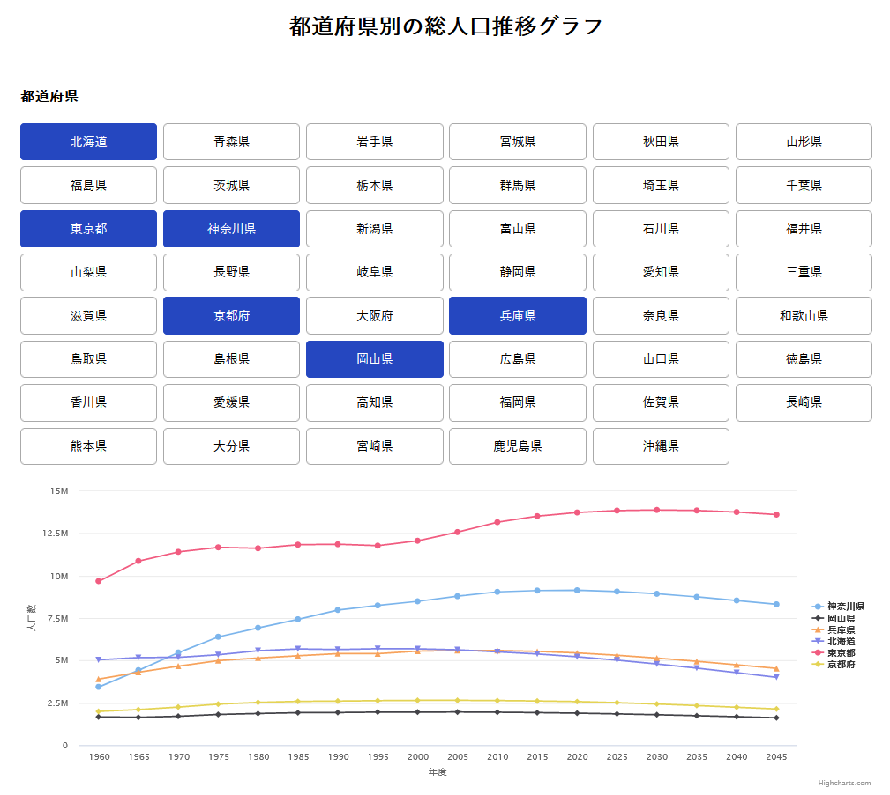

日本の都道府県の総人口推移グラフを表示するプログラムです。

## インストール

1. [https://opendata.resas-portal.go.jp/](https://opendata.resas-portal.go.jp/)からAPI Keyを取得。
2. リポジトリをクローン
   ```sh
   git clone https://github.com/goldruby112/japan-prefecture.git
   ```
3. NPM パッケージのインストール
   ```sh
   npm install
   ```
4. プログラム実行
   ```sh
   npm run dev
   ```


## プログラム実行

```sh
npm run dev
```

[http://localhost:3000](http://localhost:3000)を開いて結果を確認できます。

## Vercelで実行結果を確認する

[https://japan-prefecture.vercel.app/](https://japan-prefecture.vercel.app/)で確認できます。

<div align="center">
  <a href="https://japan-prefecture.vercel.app/">
    
  </a>
</div>